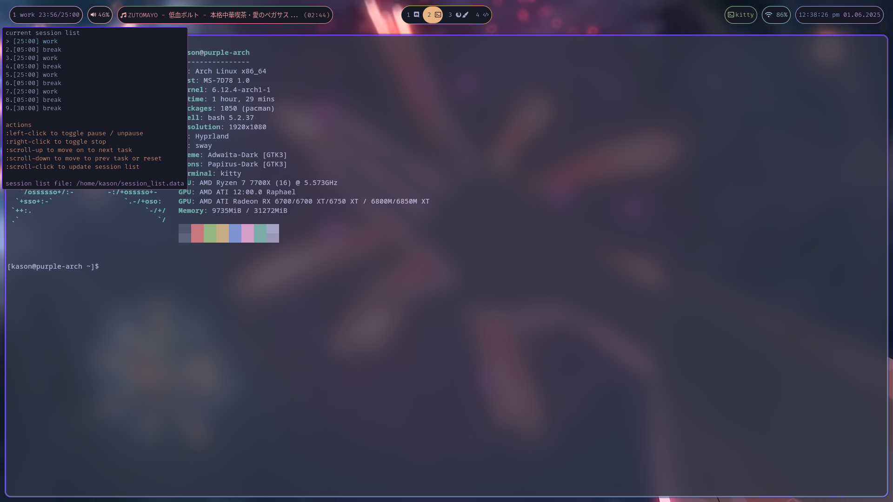

# Waybar configs

These were my personal waybar configs, you can see them below:

This repo contains 3 custom modules:

Under `/pomodoro_kt` there should be a kotlin file. When compiled, it will act
as a pomodoro server. To actually make the server run, compile the file into a jar
(or download )